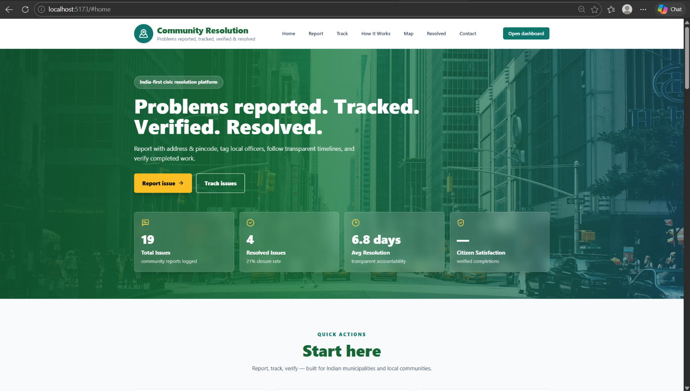
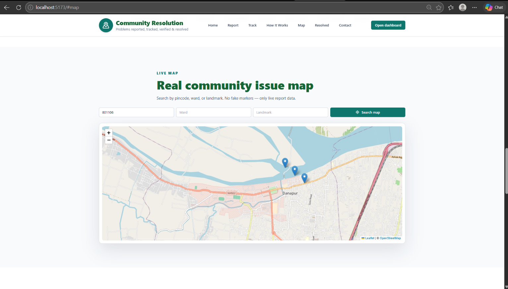
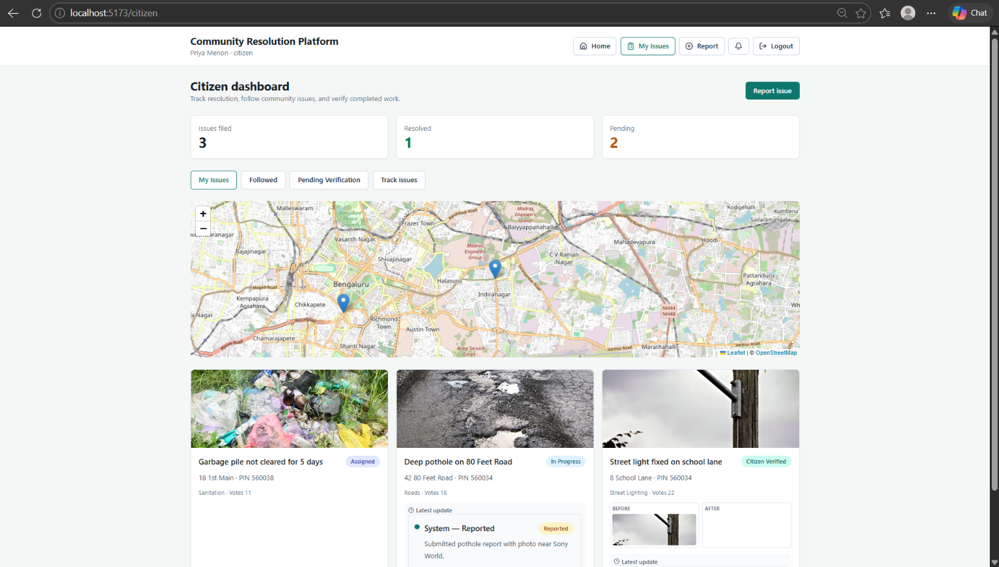
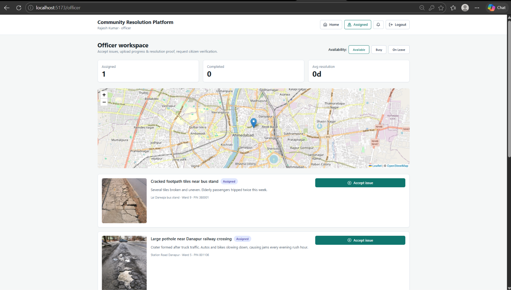

# Community Resolution Platform

> A full-stack civic technology platform for Indian municipalities that lets citizens **report, track, and verify** the resolution of local issues such as potholes, garbage, and street lighting failures.



## Overview

Citizens report civic issues with a photo and location. Officers are assigned, accept the issue, and upload progress and resolution proof. The citizen then verifies the fix, and admins oversee the whole workflow with in-app notifications along the way.

## Key Features

| Feature | Description |
|---------|-------------|
| **Public Issue Tracker** | Search by pincode, ward, or keyword. No login required. |
| **Photo Upload + Category Suggestion** | Upload a photo and describe the problem to get a suggested category, priority, and department before submitting (keyword-based; the citizen can always change it). |
| **7-Stage Workflow** | Reported → Assigned → Accepted → In Progress → Resolved → Citizen Verified → Closed |
| **Interactive Map** | Leaflet / OpenStreetMap map of reported issues, plus a location picker when reporting. |
| **Real-time Notifications** | Socket.io in-app alerts for officers and citizens. |
| **Role-Based Access** | Citizen, Officer, and Admin roles with protected routes. |
| **Admin Tools** | Dashboard with department leaderboard and category hotspots; manage issues, users, and departments. |
| **Officer Workspace** | Accept assigned issues, set availability (Available / Busy / On Leave), see assigned issues on a map. |
| **India-First Location** | Address, area, ward, pincode, and landmark fields. |

---

## Screenshots

### Public issue tracker
Search by pincode, ward, or keyword and open any issue to see its department, officer, and timeline.


### Live issue map
Search the map by pincode, ward, or landmark. Only real report data is shown.



### Citizen dashboard
Track your own issues, follow others, see before/after photos, and verify completed work.



### Officer workspace
Accept assigned issues, upload progress, and set availability.



### Admin dashboard
City-wide status counts, resolution rate, average response and resolution time, department leaderboard, and hotspots by category.


---

## Quick Start (Docker required)

```bash
git clone https://github.com/Srivalli-Gedela/community-resolution-platform.git
cd community-resolution-platform

cp .env.example .env

docker compose down -v      # first run only: wipes any old database volume
docker compose up --build -d
```

Open **http://localhost:5173**. The database is created and seeded automatically.

| URL | Purpose |
|-----|---------|
| `http://localhost:5173` | Main app |
| `http://localhost:5173/track` | Public issue tracker |
| `http://localhost:5173/admin-access` | Admin login |
| `http://localhost:5000/health` | API health check |

PostgreSQL is exposed on host port **5433** (container port 5432).

### Demo accounts

All seeded accounts use the password `password123`.

| Role | Email |
|------|-------|
| Admin | `admin.communityresolution@gmail.com` |
| Officer | `rajesh.kumar.officer@gmail.com` (more in `database/seed.sql`) |
| Citizen | `priya.menon.citizen@gmail.com` |

---

## Manual Setup (Without Docker)

**Requirements:** Node 20+, PostgreSQL 16+

```bash
cp .env.example .env        # set DATABASE_URL and JWT_SECRET for your local database
npm install
psql "$DATABASE_URL" -f database/schema.sql
psql "$DATABASE_URL" -f database/seed.sql
npm run dev
```

Frontend: `http://localhost:5173` · Backend: `http://localhost:5000`

Make sure the backend can see `DATABASE_URL` and `JWT_SECRET` (exported in your shell, or in `backend/.env`).

---

## Project Structure

```
community-resolution-platform/
├── backend/                 # Express API + Socket.io
│   └── src/
│       ├── routes/          # auth, issues, users, officers, departments, dashboard, notifications, ai
│       ├── middleware/      # auth, upload, errorHandler
│       ├── config/          # db, cloudinary
│       └── utils/           # tokens, notifications, uploads
├── frontend/                # React + Vite + Tailwind CSS
│   ├── public/demo/         # demo issue photos used by the seed data
│   └── src/
│       ├── pages/           # Home, TrackIssues, CreateIssue, IssueDetail, Dashboard,
│       │                    # AdminIssues/Users/Departments/Access, OfficerIssues, OfficerDirectory
│       ├── components/      # IssueMap, LocationPicker, IssueTimeline, IssueImage,
│       │                    # StatusBadge, NotificationBell, Layout
│       └── context/         # AuthContext
├── database/
│   ├── schema.sql
│   ├── seed.sql
│   └── migrations/
├── docs/
│   ├── API.md               # REST API reference
│   └── screenshots/         # images used in this README
├── docker-compose.yml
├── .env.example
└── DEPLOY.md                # Production deployment notes
```

## API

See [`docs/API.md`](docs/API.md) for endpoints. The base URL is `http://localhost:5000/api`, and protected routes need `Authorization: Bearer <jwt>`.

## Tech Stack

**Frontend:** React 18, Vite, Tailwind CSS, React Router, Leaflet / React-Leaflet, Axios, Socket.io Client  
**Backend:** Node.js, Express, Socket.io, JWT auth, Multer, Cloudinary (optional), Helmet, rate limiting  
**Database:** PostgreSQL 16  
**DevOps:** Docker, Docker Compose

---

## Team

| Name | Contribution | GitHub |
|------|-------------|--------|
| Harini | Auth System, Issue Map, Notifications, API Routes, Database Schema, Docker | [@harini-collab](https://github.com/harini-collab) |
| Srivalli | Dashboard, Officer Pages, Admin Panel, Backend Routes, Socket.io, Cloudinary | [@Srivalli-Gedela](https://github.com/Srivalli-Gedela) |
